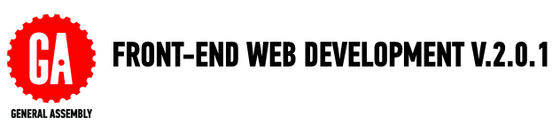

##GETTING STARTED WITH CURRICULUM

Welcome to the FEWD Curriculum v. 2.0.1. 

This repository contains all the materials GA supplies its Front-End Web Development instructors. 

General Assembly's Front-End Web Development (FEWD) course is made up of 20 lessons that are 3 hours each. This course is split into 3 week units. 

*	Unit 1: HTML/CSS Basics
*	Unit 2: Adding Interactivity
*	Unit 3: Building In Concert 

###Before The Course Responsibilities
 
We __highly recommend__ you begin preparing your lessons before the course starts. You should start prepping to teach the materials 4 - 6 weeks prior to course launch. A good benchmark is to prepare the first 5 - 6 lessons before the course begins. 

During these preparation weeks you should: 

*	Update slides for each lesson.

*	Review solutions and make sure you agree with the way it was coded. Keep in mind students coding level, but __don't share code you don't agree with__.

*	Review all curriculum materials and think about how you would like to apply your teaching style and professional experience to the classroom. 

##AVAILABLE MATERIALS

We've supplied a folder for each week and lesson. In these folders we've included:

|Materials | Description | How to Use It|
|----|---------|---------------|
| __README.md__| Topic break down and suggested schedule. | Use this to get a high level view of the week and each lesson. It is meant to help you prep for the course.|
| __Slides__| Markdown file with slide content.| Customized the deck before sharing with students in pdf format (more on that during your on board). We suggest using [reveal.js](https://github.com/hakimel/reveal.js) to present to the class. Keep the same folder structure so that image relative paths still work.|
| __Code Alongs__| Code to be used by instructors to help demonstrate a concept.|Type slowly and explain the concepts while students follow along with code and type their notes. |
| __instr_code_along_notes.md__| Notes from the curriculum fellow about how to implement particular code along.| As we gain feedback from instructors and students, we've become aware of student pain points. This document contains notes to help you deliver the best course.|
| __Exercises__|Code examples to be completed without instructor guidance.| You should read the instructions and solution files. You must be able to further explain content to students.|
| __Starter Code Folder__| This is a folder with all the starter code students need for that lesson.| You should share this folder with students before every lesson. Make the necessary changes if you are using different code.|
| __Solution Folder__| This is a folder with all solutions to code alongs and exercises| Share individual solution files as needed. Student should have code demo solutions before lab time to use as a reference.|

###How To Prepare For Each Lesson

1.	Read the weekly Readme, and take a look at the weekly assigment

2.	Review the lesson agenda schedule and learning objectives. Become familiar with what we would like students to accomplish for a particular lesson.. 

3.	Dive into the lesson planning notes.

4.	View the solution file, and make sure you agree with the solutions. If you don't, change it before you share with students. Students want to feel like you are in command of all materials you share with them.

5.	Decide how you will bring your expertise to the classroom.

6.	__Use The Slide Deck To Determine lesson flow.__ The slides.md files we provide is a base. You need to update it and make sure it fits the story you want to tell. If you prefer not to use slides, use the markdown file to help you plan the flow of the class.

7.	If not using the GA suggested in code alongs, create your own and make sure it hits the same topics and learning objectives for that lesson. Please share your changes or new code alongs with the curriculum team. We want to build the best curriculum and that can only happen with your help.

8.	Practice using reveal.js. It can be tricky to get the hang of the workflow. 

###Slides

*	We suggest using reveal.js with external markdown.

*	Any text following the line `Note:` in a given slide will not appear in the presented deck. However, when you share the rendered markdown (i.e as a pdf), students will see the notes. This is a great place to put presenter notes and additional information you would like students to read outside of class.

*	See [here](https://github.com/hakimel/reveal.js) for further documentation about Reveal.js. 

The slides are a skeletal deck and require your input! If there are slides you do not agree with then update them. If you want to introduce topics in a different order, then reorder them. 

##GRADING

In order to pass this course General Assembly students must:

*	Complete and submit 80% of all course homework assignments. 

	*	Students will receive feedback from instructors on their assignments within 2 - 4 days. 

*	Complete and submit the course [final project](Final_Project/final_project_requirements.md) including all milestones.

##AVAILABLE TECHNOLOGY

*	We are working on a free hosting solution for students. In the mean time, we recommend using dropbox to host sites. 

##MORE TERMINOLOGY

|Term|Description|
|---|---|
|Course|Refers to all 20 classes which make up the FEWD curriculum|
| __Lesson__ |One 3 hour session of the course. |
| __In Class Lab (ICL)__|Exercise files that are to be used in class as examples and practice.|
|[Final Project](Final_Project/final_project_requirements.md)|The personal project each student will submit and present. Share the project requirements as early as possible.|
	

##QUESTIONS

If you have any questions please send them to your Education Product Manager, [Jessica Skeete](jessicat@generalassemb.ly)

