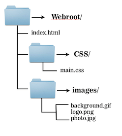
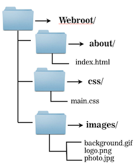
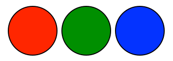
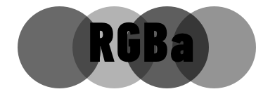

#FEWD - Lesson Name 

###Instructor Name

Instructors current role.

---


##Agenda

*	HTML Basics Review
*	Images
*	Intro To CSS
	*	Link Tag
	*	Colors
	*	Fonts
*	Linking To Other Pages
*	Lab Time

---


##What Tag Is It?

---


##Review
###What Tag Is It?


---

##Images
###Html Basics

Images are placed using the `````` tag.

####``````

---

##Images
###Html Basics

The `img` tag requires a `src` attribute, which tells the browser where to find the image to be placed.

---

##Images
###How would You Write the Src?

There are different approaches to specifying an image location


			
---

##Images
###Relative

*	Inside ```webroot/index.html````, a relative path could be used:
	
####``````

---

##Images
###Relative
	
* Given this folder structure the same image would be



	
####``````

	
Note that ```..``` means to go up a directory, and can be used repeatedly: `../..` would go up two directories.


---

##Images
###Absolute

####``````

<aside class="notes">
	Absolute URLs start with a `/`, so if we imagine that our `webroot` directory was stored on a server such that the `webroot/index.html` file is accessible at `http://example.com/index.html`, then placing the logo image could be done from any html page with: ``````
	
The benefit here is that this same ```src``` path works on any html page, no matter what its location, so the same ```img``` tag can be used on both the ```webroot/index.html``` page and the ```webroot/about/index.html``` page.
	
The downside is that the path only works if the project is stored to a proper location for serving.
</aside>

---


##Images
###Full URL

		
####``````
		
<aside class="notes">
For linking to images, make sure that you have permission to use the image in this way. Even then, it is often better to host a copy of the same image, rather than link to another server, because it reduces dependency.
</aside>

---

##Images
###alt attribute

####``````
*	A piece of text to be used in lieu of the image when the image is unavailable

*	Using `alt` attributes has the added benefit of giving search engines more linguistic context about the image as it is used on your page.

<aside class="notes">

Reasons an image may not load: 

* There was a connection error, the browser didn't download the image.
* The file was not found, perhaps because the image got moved elsewhere and the page wasn't updated yet to reflect the change.
* The user is running a text-based browser such as an older phone with a WAP-style browser, or a non-graphical browser like lynx.
* The user is using a screen reader because she has low vision, which will read the `alt` text aloud or present it through a braille reader.
</aside>

---

##Image
###File Formats

####There are three main image file formats:

---

##Image
###File Formats


####.png
* 	Supports transparency and semi-transparency, great for logos, icons, and repeating background tiles. Almost always preferable to a `gif`, unless semi-transparency is not needed, and the `gif` format is significantly smaller.


<aside class="notes">

</aside>

---

##Image
###File Formats


####.gif
*	Can have basic transparency, typically a `png` is used instead.

---

##Image
###File Formats

####.jpeg
*	No transparency, can be stored at different compression levels with varying amounts of "lossy-ness", typically the best format for photos. (Try to balance between photo quality and file size.)

---


##About Me

---

##CSS
###Sub Topic


<aside class="notes">

</aside>

---

##Casscading Style Sheets (CSS)
###Colors

Colors can be specified in CSS in a variety of ways:



<aside class="notes">
* keyword
* hex codes
* rgb
* hsl
* rgba
* hsla

</aside>

---

##Color
###Color Keywords

These are used less frequently, but are handy for basic colors like `black` and `white`. There are several

See [here](http://msdn.microsoft.com/en-us/library/ie/aa358802(v=vs.85).aspx) for more:

---

##Color
###Hex Codes (RGB)


<aside class="notes">
"Hex" values are so-called because they use hexadecimal, or base-16, to describe the color values for red, green, and blue. Each of the 3 color values is expressed by two hexadecimal digits, from `00` (no color) to `FF` (full color), and are written in the order red, green, then blue, after an initial `#` sign.

Hex values can be abbreviated to only 3 digits if each digits is doubled. So `#FFFFFF` (white) can be expressed more succinctly as `#FFF`, and `#000000` (black) can be expressed as `#000`. `#FA6198`, however, cannot be abbreviated without altering the color.

</aside>

---

##Color
###RGB Color Values

####```rgb(0,0,0)```

*	The first value is red, the second green, the third blue.
 
*	Each value can range from 0 to 255, which expresses the same number of color steps as 00 to FF in base-16.


<aside class="notes">
FF in base-16 is equivalent to 255 in base-10.

In RGB, `rgb(0,0,0)` is black, `rgb(255,255,255)` is white, `rgb(255,0,0)` is red, etc.

White-space is allowed *inside* the parentheses, so `rgb(255, 0, 0)` will do just as well.
</aside>

---

##Color
###RGBa Colors


*	RGBa works identically to RGB, expect that it takes a 4th value called the "alpha".
*	This is a value between 0 and 1 which will be used to determine a color's opacity on the page,




<aside class="notes">
0 is completely transparent, and 1 being solid. 0.5 or .5 is 50% opacity.

Thus, __rgba(0,0,0,.25)__ is black at 25% opacity and __rgba(255, 255, 255, 0.8)__ is white at 80% opacity.

The alpha value can be in decimal form but cannot use a percentage. When a decimal is used, the leading zero is optional.
</aside>

---

##Color
###HSL Colors

####HSL
*	Similar notation to RGB values, but specify colors using hue, saturation, and lightness.


####HSLa
*	As with RGBa, HSLa is exactly like HSL for the first 3 values, but takes a 4th alpha-channel value.

<aside class="notes">
**Hue** is expressed as a degree angle measure, with red being at 0, green at 120, and blue at 240. Note that the degree unit is implied, and that the angle wraps around, so 360 also refers to red, and -120 is the same as 240 (blue).

**Saturation** is expressed as a percentage, with 100% being a fully saturated color, and 0% being a shade of gray (no hue).

**Lightness** is also expressed as a percentage, 0% being black, and 100% being white. 50% lightness is the "normal" color range: anything above 50% gives a white tint, anything below 50% gives a black shade.

As an example, red is ```hsl(0, 100%, 50%)```, which is equivalent to ```#FF0000```.

Note that changing the opacity allows whatever colors are "behind" an element to shine through, which can alter the visible color significantly, especially at lower opacities.
</aside>

---


##CSS
###Review

Add a couple points here wit hthe major take aways foe the basics of CSS.


---


##Lab Time
*	Wendy G. Bites - Resume.

---

## Homework

*	Create your own about me and resume page. Get creative with the style.
*	Read….

---