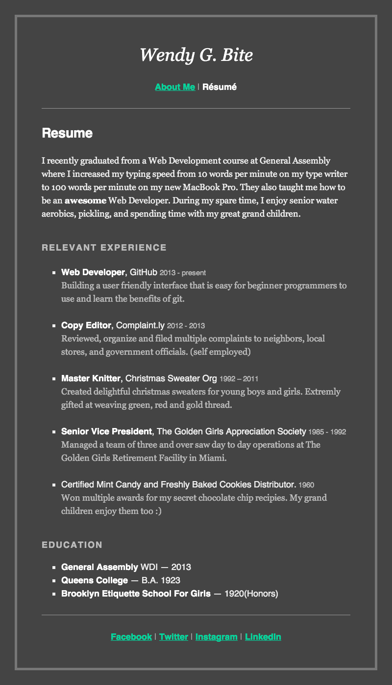

##Week 1 - The Basics

This week is about leveling the playing field. 

There will be some students who find this week slow. But we want to make sure all students are at a basic level before moving on, this will make the rest of the class go smoothly. Take this time to make sure students understand how sublime text (or any other text editor you choose) and chrome are working together.

*	Assignment: Build a personal online résumé 

*	In Class Project: Wendy G Bite: 

