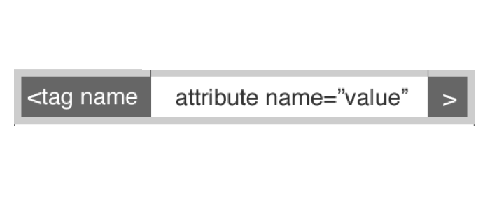

#FEWD - Box Model & More CSS

###Rohan Dhaimade

Ooh fancy boxes.

---


##Agenda

*	Review
*	Box Model
*	Nested Selectors
* Block vs Inline Elements
*	HTML Template
*	Lab Time
	*	How To Start

---

##Objectives

- Explain the box model and how it affects styling
- Utilize nested selectors for advanced styling
- Differentiate between block and inline elements
- Learn new strategies for starting a project

---

##Review

What do students need help with?

---

##Box Model

Every element in web design is a box.

---


##Box Model


---

##Box Model

###Width = width + padding-left + padding-right + border-left + border-right

###Height = height + padding-top + padding-bottom + border-top + border-bottom

Way to remember: When you measure a box for shipping. you include thickness of the cardboard, you include any extra space inside.

---

##Box Model

When writing padding or margin rules in CSS, there are some shortcuts:

- margin: 10px; means that your box will have a margin of 10 pixels on all four sides.
- margin: 5px 10px; means that your box will have a margin of 5 pixels at the top and bottom, and 10 pixels on the right and left. (In this shortcut, the first number always applies to top and bottom, and the second number always applies to left and right.)
- margin: 5px 10px 6px 12px; means your box will have a margin of 5 pixels on top, 10 pixels on the right, 6 pixels on the bottom, and 12 pixels to the left.

---


##Box Model

---

##Nested Selectors

A nested selector allows you style elements with more specifics rules.

---

###Nested Selectors

For instance, you might have a ```<blockquote>``` on your page. Sometimes this blockquote has many paragraphs (```<p>``` tags) within it. You might have an overall style set for your p tags, but you want the p tags within your blockquote to look different than the other p tags. You do this by using nested selectors.

In HTML, your code might look like this:

    <blockquote>>
      <p>Some paragraph here</p>
    </blockquote>

---

##Nested Selectors

If you write a CSS rule for a nested selector, you list the outer tag first, then the second tag (the nested tag or selector) next. Like this:


```
blockquote p {
    color: #999999;
    font-style: italic;
    font-weight: bold;
    margin: 12px 40px;
}
```

---

##Nested Selectors

---

##Divide and Conquer

There are many tags you can use to section off your content. We've talked about a few of these already, such as ```header```, ```footer```, ```section```, ```article```. There are two other tags that you'll use a lot, maybe even more than those HTML5 tags:

* div
* span

---

##Block and inline elements

Many tags are __block elements__ by default in HTML. Examples of these tags are: ```p```, ```ul```, ```div```, ```header```, ```footer```, ```article```, ```h1``` (and all the h tags).

Think of them as giant boxes. They are good containers. They also tend to occupy the entire width of your page by default (unless you tell it not to). This often means they sit on their own line and push everything else out of their way.

---

##Block and inline elements

__Inline elements__ play nice with other content. They tend to sit within block elements. As the name implies, they sit in line with whatever surrounds them. Examples of inline elements are these tags: ```a```, ```img```, ```span```.

---

##Div vs. Span

###Div

* Divs are block elements. They <i>div</i>ide the page into sections.
* Because they divide elements, they like to be on their own line.

---

###Span

* Spans are inline elements. They're helpful for when you want make something look different within a div (or any block element, for that matter). But you don't want that styled thing to sit on its own line.

---

##Span example

* Let's say you have a header but you want your first letter to be much bigger than your other letters


---

##Span example
* This would lead to a normal header
```
  <h1>Header</h1>
```

<h3 style="text-transform: none">Header</h3>

---

##Span example
* This would allow you to style that letter specifically
```
  <h1>
    <span>H</span>eader
  </h1>
```

```
  h1 span {
    font-size: 2em;
    color: red;
  }
```
<h3 style="text-transform: none"><span style='font-size:1.5em; color: red;'>H</span>eader</h3>

---

##Other Inline examples

We already used it! Look back at the code along about nested selectors!

The ```<em>``` tags inside the paragraph are inline elements.

---

##Classes and Ids

With classes and ids, we can organize how we manipulate elements on a page.

You can add a class or an ID to any HTML tag. This can allow customized styling to that element

---

##Classes and Ids

###Ids are unique

You add an id to an item that will only be used once on a page (headers, footers, etc). This will be important for javascript and dynamic programming.


### Classes are for organizing

You can re-use classes, you can add it to any element regardless of what tag it's applied to. This becomes handy when you want to style common things (example: buttons on a page)

---

##Classes and Ids



---

##Classes and Ids

HTML example

    <p class='slanted-paragraph'>
      We want text inside slanted paragraphs, to be italics
    </p>

CSS

    .slanted-pargraph {
      font-style: italic;
    }

This will make any element with the class 'slanted-paragraph' have italics font. But only those, it will not affect all paragraphs. So if you want multiple slanted paragraphs on a page, you only have to make one css rule.

---

###Getting Started

How do you get started?

---


##Fashion Blog

---

