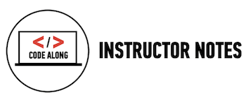

##Lesson 04 - Layout


###Learning Objectives

*	Draw the DOM Tree for web pages containing sections ```<div><section>```.

*	Apply header, footer, sidebar, and multi-column layouts to develop a web page.

*	Experiment and predict effects of floats and clearing CSS positioning.

*	Describe the use of Normalize and reset.css files.


###Schedule


| Time        | Topic| GA Suggested| Comments |
| ------------- |:-------------|:-------------------|:----------------|
| 15 min| Review| | |
| 30 min| Classes, IDs, Divs| [Classes_Ids]()| |
| 20 min |HTML5 structural elements | [Floating Sections]() | Some basic HTML5 structural elements (header, aside, footer)|
| 50 min | Floats| [Floating Sections]() | We use the structural elements and float them on th page. |
| 10 min | How To Start| ['Div' Up The Content]() | Show students how and where to start. During lab time we will give students a png they will reproduce using HTML and CSS. |
| 45 min | Lab Time | [Fashion_Blog]() part 2 | Students add more complex elements and styling to the Fashion blog.|


###[Homework](../Homework/)

*	Students complete the fashion blog see [completed version]().

---




## [Classes_IDs](http://codepen.io/nevan/pen/JnfEd)


###Time: 30 min

| | |
| ------------- |:-------------|
| __Topics__ | divs, classes, ids | 
| __Description__| sandbox type activity to show how and when to use Classes and Is |   
| __Activity Type__| code along| 
 

####Instructional Design Notes

*	When explaining classes and IDs it is important to tell students, when to use classes and when to use ids. The code along highlights this.


## [Floating Sections](http://codepen.io/nevan/pen/nHIEo)


###Time: 60 min

| | |
| ------------- |:-------------|
| __Topics__ | header, aside, footer, floats | 
| __Description__| sandbox activity to demonstrate floats and structural elements. |   
| __Activity Type__| code along | 
  

####Instructional Design Notes

*	This is a barebones example so we can isolate floats and structural elements. 

*	Students will transfer what they learn here and apply it to the fashion blog. 

*	To help students understand how this sandbox code along would apply to a real site, show them floating elements on a real web page. You will need to teach students how to identify content sections on a web page in order for them to be able to successfully apply floats during lab time.

*	This is also a good time to refer to the DOM tree.


---
 


##'Div' Up The Content

####Time: 10 min

| | |
| ------------- |:-------------|
| __Topics__ | Identifying content sections (divs, classes, ids) | 
| __Description__| Students determine what divs, classes and ids they require for Fashion blog part 2. |    
| __Activity Type__| group exercise| 


####Instructional Design Notes 

*	Give students 10 min to determine what divs, classes and ids they require to build the Fashion Blog. 

*	Instructors have found it helpful to provide black and white printouts of the final page and ask students to draw boxes around content they think should be grouped together as a div. 
	*	Once students have identified sections, ask them to determine which boxes/divs should have a class or id. Encourage students to look for similarities to determine what should be a class. 

*	After 10 min share your answers of how the site should be sectioned. They will use this to code.


##[Fashion Blog Part 2]()

####Time: 45 min

| | |
| ------------- |:-------------|
| __Topics__ | planning and building a website. | 
| __Description__| Students add more styles and content to the fashion blog. |    
| __Activity Type__| exercise | 


####Instructional Design Notes 

*	Make sure students know the content sections and structural elements needed to complete the exercise.  

*	Encourage students to plan before they begin coding. We want them to be thoughtful about what they are doing and how they are approaching the exercise.

*	Students complete the site for homework.


---


[](slides.md)

click icon for slides.
