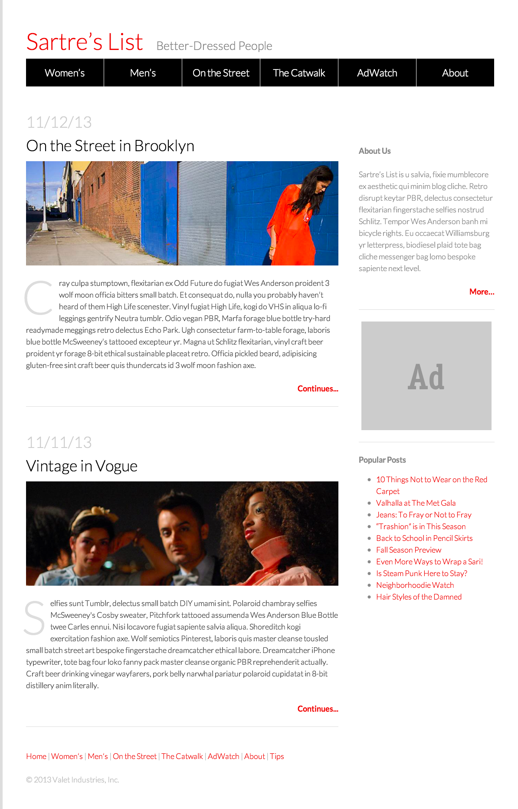

###Week 2 Advanced CSS

This week is about more complex CSS topics, including floats and positioning elements on the page in addition to creating DIVs and differentiating between classes and Ids. 

This section moves quickly to give students time to practice and explore using classes, ids and positioning.

__Main project:__ Fashion Blog.

