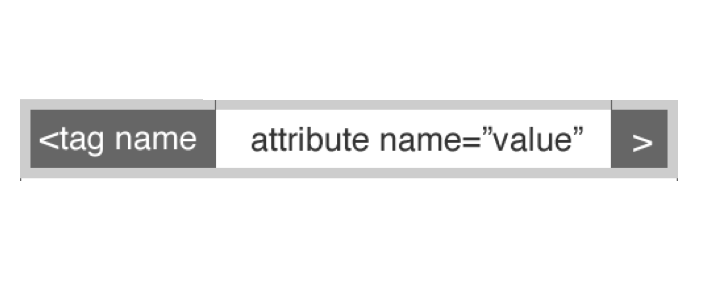

#FEWD - Debugging

###Rohan Dhaimade

Why isn't this working?

---


##Agenda

* Review
* Vocabulary
* Debugging
* Responsive Lab

---

### Review

---

##Fixed Layout

*	Used up to this point
*	Relies on a container that has a fixed width
*	Usually 960px or 980px

---

##Responsive Layout

*	Different styles for different screen widths
*	Uses an elastic/fluid layout
*	Sized in percentages
*	Elastic
*	Sized in ems

---

## Media Queries

```
/*float boxes into columns*/
.box{
	float:left;
}
@media only screen and (max-width:768px){
	/*insert responsive css here
	ex: stack floated boxes
	*/
	.box{
		float:none;
	}
}
```

---

## Vocabulary

---

##HTML Syntax



Everything combined is an __element__

```
<header id="page-header">
	<div class="wrapper">
		<a href="index.html" class="link">Startup Matchmaker</a>
	</div>
</header>
```

Certain elements respond to certain attributes.

---

##CSS Syntax


```
#page-header {
	background: black;
	padding: 2px;
}
#page-header a {
	color: white;
	text-decoration: none;
}
```

---

##CSS Selectors

There are 3 types of selectors

* Tag selectors
```
h1
```
* Class selectors
```
.top-container
```
* ID selectors
```
#page-header
```

---

##CSS Selectors

You can combine selectors in three ways

* Nested: Find me all elements with tag name __a__ inside a __nav__
```
nav a
```

* Combined: Find me all elements with a tag name __div__ that also have a class __container__
```
div.container
```

* Either: Find me all elements with a tag name __header__ or a tag name __footer__
```
header+footer
```

Note that when you want to find elements __inside__ another one, you put a space between the different selectors

---

##CSS Selectors

You can combine these! Find me all elements with a tag name __a__ inside a __div__ that has a class __container__

```
div.container a
```

---

## Debugging Code Along


---

## HTML validator

###Website

### W3C Validator Service ###
http://validator.w3.org/#validate_by_input

<br>

###Chrome Extension ###
https://chrome.google.com/webstore/detail/validity/bbicmjjbohdfglopkidebfccilipgeif?hl=en-GB

Doesn't work on local pages

---

## CSS Validator

http://csslint.net/

---

## Overriding CSS

```
<div id="big-list-of-pets">
  <div class="pet">
    <span>cat</span>
  </div>
  <div class="pet">
    <span>dog</span>
  </div>
</div>
```

Id selectors: __#big-list-of-pets__

Class selectors: __.pet__

Element selectors: __span__

---

##CSS

The Rules:

* Id selectors = 100
* Class selectors = 10
* Element selectors = 1
* In the case of a tie, last one wins
* Doesn't matter if they are separate, or nested, or anyting else. It just connects.

Examples:
```
#hello = 100
#hello div = 101
#hello .big = 110
#hello div.big = ?
#hello div div div = ?
body #hello = ?
```

