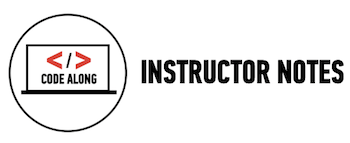
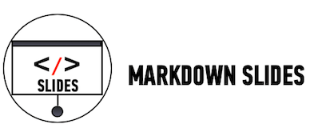

##Lesson 06 - Introduction To Programming


###Learning Objectives


*	Practice programmatic thinking by writing pseudo code to solve a basic problem.

*	Define web site behavior and the practical uses of JavaScript.

*	Predict DOM output / changes by reading JS code.

###Schedule


| Time        | Topic| GA ICLs| Comments |
| ------------- |:-------------|:-------------------|:----------------|
| 75 min | Introduction to Programming| [Thermostat]() <br> [Rock Paper Scissors]() |  |
| 10 min | Introduction to JS | [What JS Can Do]() | A discussion about JS functionality. Based on the JS video students watched for [homework](https://generalassemb.ly/online/videos/what-can-you-do-with-javascript/cinema?chapter=3).|
| 60 min | Reading JS | [Color Switcher]() <br> |  |
| 30 min | Lab Time| [Traffic Light]()  <br> |  |


###[Homework](../Homework/)


---



 
##Thermostat

####Time: 30 min

| | |
| ------------- |:-------------|
| __Topics__ | pseudo code, conditionals, loops, variables | 
| __Description__| Pseudo code for an application that would monitor the room temperature and adjust it so the room remains at a certain temperature. |    
| __Activity Type__| Class Exercise | 


####Instructional Design Notes 

*	The idea of programming is foreign to students. This class exercise is to introduce students to what it means to program.

*	White board and walk students through writing a program for that controls a thermostat. Highlight variables, conditionals, and loops. Again, the purpose of this exercise is to introduce students to what it means to program. 

*	We've chosen a thermostat; feel free to change if you like. 


Sample Pseudo Code For A Thermostat.

```
get target_temprature
target_temperature = 72
repeat forever,
      current_temperature = get_sensor_reading
      if target_temperature > (current_temperature+5),
          turn_on_heater
      if target_temperature <= current_temperature,
          turn_off_heater
```

## What JS Can Do!
###Time: 15 min


| | |
| ------------- |:-------------|
| __Topics__ | |
| __Description__| Class discussion about JS capabilities. Base discussion around this video [What Can I Do With JavaScript](https://generalassemb.ly/online/videos/what-can-you-do-with-javascript/cinema?chapter=3) introduction and chapter 1. |
| __Activity Type__| Class discussion | 

####Instructional Design Notes

*	The goal of this exercise is to identify what JS will allow us to do with our websites. We say behavior, but students don't actually know what that means. Lets break it down for them.

*	Students were asked to watch GA's Front Row video: "[What Can I Do With JavaScript](https://generalassemb.ly/online/videos/what-can-you-do-with-javascript/cinema?chapter=3) chapter 1." 

*	Choose a couple of sites that you've built that use JS events (i.e. clicking, scrolling). Have your students visit the site and ask if they can identify what is powered by JS.

*	Ask students What can JS DO? Lead the conversation around some of the basics and not so basic things that are powered by JS (events are basic to understand, node and working with data is advanced).


## [Color Switcher](http://codepen.io/nevan/pen/kBItz)

###Time: 60 min

| | |
| ------------- |:-------------|
| __Topics__ | html, css, js, functions |
| __Description__| Walk students through the flow of a JS program. |
| __Activity Type__| Code along / walk through | 

####Instructional Design Notes

*	We want to teach students how to read code. This is based on the assumption that when you are a child you learn to speak and read before you learn to write. We learned to speak JS with the discussion, videos, and pseudo code activities. Now lets teach students how to read. Specifically we want students to understand control flow. 

*	This code is meant to be demoed in Codepen. We are not focused on syntax, just the flow of the program. This example uses very descriptive function names so that it is easy to follow. By using Codepen students can see the code and interact with the output and start to build a mental model about how JS code interacts with HTML and CSS. 
	*	For example, in this exercise students can click on a color, see the background change, and then view the code to begin to infer how it all works together. 

*	The instructor's job during this walk through is to highlight the flow of control in the program without using heavy jargon. Here is an example:
	*	JS  "listens / observes" for when the user clicks on a list item with the id "x" (.onclick and select element by id).
	*	It then calls this block of code. (functions)
	*	This block tells JavaScript to, "change the background color to..."
	*	Now ask questions to check for understanding (e.g. What would I do if I wanted to change the yellow button to red and change the background to red when its clicked)? 
	
*	Let students know that there are many ways to write a program, and we will learn how to make our code more efficient as we go.

---
 


##Rock Paper Scissors

Materials: Post its.

####Time: 30 min

| | |
| ------------- |:-------------|
| __Topics__ | pseudo code, programmatic thinking | 
| __Description__| Now we let the students go on their own. They will write pseudo code on their own to program a computer to play the game rock paper scissors.  |    
| __Activity Type__| group of 3 - 4 | 


####Instructional Design Notes 

*	Encourage students to use the thermostat syntax for clues. 
*	They should write each line of instruction onto a post it and start to put the post its in order to form the program.
*	If time permits, ask the students to walk around and view what other groups came up with.
*	Again there is no solution to this exercise. This exercise is to get students thinking programatically. 


##[Traffic Light](http://codepen.io/nevan/pen/shtLA)

####Time: 30 min

| | |
| ------------- |:-------------|
| __Topics__ | reading code, functions, .onclick| 
| __Description__| Students read code and make small changes. The goal is to continue to build on the mental model of how JS works with HTML and CSS.|    
| __Activity Type__| paired| 


####Instructional Design Notes 

*	We are going to ask students to read code and make small changes

*	Share the Codepen link. 

*	The yellow button changes the bulb to purple and the green light does not work. Students are to change the code so that the traffic light works correctly.  	


[](slides.md)

click icon for slides.
