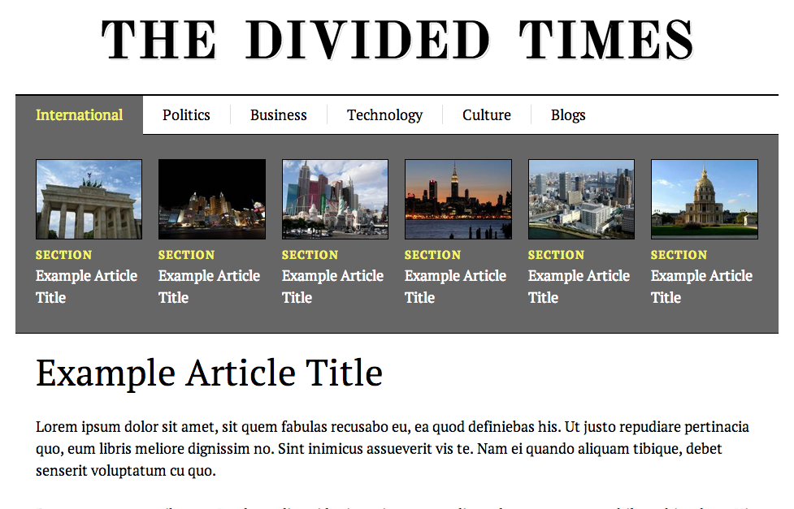

###Week 5 - Intro jQuery

Before we move into building in concert lets show students jQuery so they can build faster. This week we show students how to use the jQuery library and arrays.

__Main project:__ Divided Times

