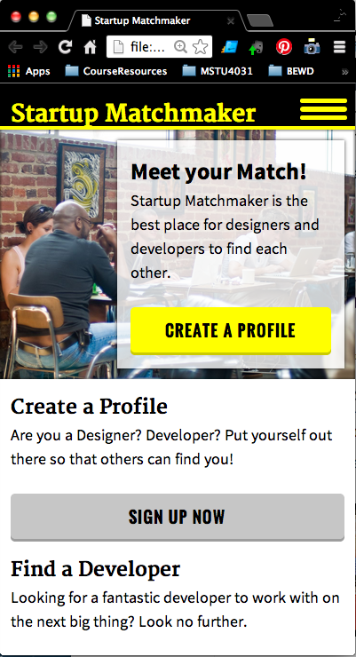

###Week 7 - Multiple Screens

This week we teach students how to make websites responsive. This will bring the focus back to HTML and CSS. We will take a break from learning new JS topics. However, students will add JS to make a hidden navigation bar in the mobile version of Startup Matchmaker.

The goal is to take students through the responsive design process. 

Main Project: Making Startup Match Maker Reponsive
