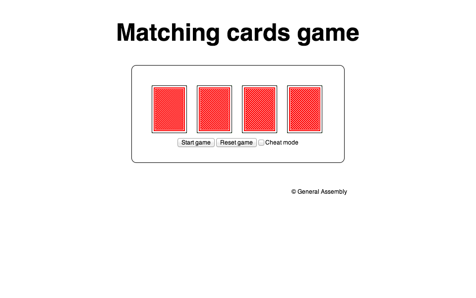

###Week 6 - Review & Refactor

This week we teach students how to write more efficient code. We will introduce debuging techniques and the keyword "this". We also ask students to re write code from lesson 11 after they learn refactor and debugging techniques.

__Main project:__ Card Matching Game

